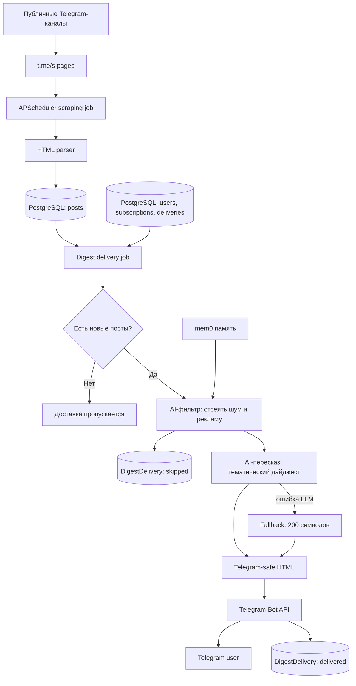

# Channel Scanner

[](https://github.com/bzzbbzbz/Channel-Scanner/actions/workflows/ci.yml)

Channel Scanner - pet-проект для портфолио: Telegram-бот, который собирает посты из публичных Telegram-каналов, хранит их в PostgreSQL и присылает пользователю персональные дайджесты по расписанию.

Бот: [@ChanScanbot](https://t.me/ChanScanbot)

Проект сделан как полноценный backend-сервис, а не как набор скриптов: есть миграции, асинхронная работа с БД, планировщик задач, Telegram Bot API polling, LLM-интеграция, fallback-сценарии, тесты и документация архитектурных инвариантов.

## Что умеет

- Управляет пользователями и именованными подписками прямо в Telegram.
- Позволяет добавлять публичные каналы в конкретную подписку, а не глобально на пользователя.
- Периодически парсит публичные страницы `https://t.me/s/<channel>` без Telegram Client API.
- Хранит посты, каналы, подписки и историю доставок в PostgreSQL.
- Отправляет дайджесты по расписанию с учетом часового пояса пользователя.
- Не присылает исторические посты, опубликованные до добавления канала в подписку.
- Дедуплицирует доставку на уровне пары `подписка + пост`.
- Поддерживает два режима дайджеста: короткий формат `200 символов` и LLM-пересказ.
- Использует OpenRouter-compatible Chat Completions API для суммаризации.
- Не блокирует доставку, если LLM недоступна: бот автоматически откатывается к короткому формату.
- Рендерит сообщения в Telegram-safe HTML.
- Поддерживает natural-language управление подписками через LLM-инструменты и локальную mem0-память.

## Инструменты ассистента

Ассистент понимает обычные сообщения и использует только инструменты с областью доступа текущего пользователя:

- `getSubscriptions`, `getSubscription` - показать подписки, их каналы и настройки.
- `createSubscription` - создать именованную подписку после явного подтверждения.
- `addChannels`, `removeChannels` - добавить или удалить публичные каналы в конкретной подписке.
- `setNotification` - установить расписание уведомлений в формате cron.
- `setDigestFormat`, `setSubscriptionEnabled` - включить AI-пересказ и активировать либо отключить подписку.
- `setFilterPrompt`, `setSummaryPrompt`, `resetPrompts` - настроить или вернуть стандартные AI-инструкции.
- `getRecentDigests` - показать недавние дайджесты пользователя.
- `getDigestProcessingLogs` - вывести количества найденных, отфильтрованных и включенных постов за выбранный период.
- `generateOnDemandDigest` - собрать и прислать дайджест по явно названной подписке за указанный период; повторный запрос переиспользует сохраненный результат.
- `debugDigestPrompts` - безопасно проверить кандидатные filter/summary prompts на уже сохраненных постах без доставки и изменения настроек.

Ограничения по умолчанию: до 5 подписок на пользователя, до 10 каналов в подписке и до 10 вызовов инструментов за один запрос ассистенту.

## Архитектура

Приложение запускается одним Python-процессом:

1. Загружает настройки из `config.toml` и переменных окружения.
2. Создает async SQLAlchemy engine и фабрику сессий.
3. Создает HTTP-клиент для чтения публичных Telegram-страниц.
4. Запускает `APScheduler` для парсинга, обновления LLM-моделей и доставки дайджестов.
5. При наличии `BOT_TOKEN` запускает Telegram bot polling через `aiogram`.
6. При `ADMIN_ENABLED=1` запускает изолированную read-only admin dashboard на внутреннем порту `8080`.

Если `BOT_TOKEN` не задан, scraper и scheduler могут работать без Telegram polling.

Основной поток данных:



Mermaid-схема и ключевые архитектурные решения описаны в [`docs/architecture.md`](docs/architecture.md).

## Стек

| Зона | Технологии |
| --- | --- |
| Язык | Python 3.11+ |
| Telegram bot | aiogram 3.x, Telegram Bot API polling |
| Планировщик | APScheduler |
| База данных | PostgreSQL, SQLAlchemy asyncio, asyncpg |
| Миграции | Alembic |
| HTTP и парсинг | httpx, BeautifulSoup4, markdownify |
| LLM | OpenRouter-compatible API, динамический pool бесплатных моделей |
| Память ассистента | mem0, локальное хранилище в `.data/` |
| Тесты | pytest, pytest-asyncio, in-memory SQLite для интеграционных тестов |
| Деплой | Docker, Docker Compose |
| Admin dashboard | FastAPI, Uvicorn, host-managed Caddy TLS reverse proxy |

## GitHub

- CI настроен через GitHub Actions: [`ci.yml`](.github/workflows/ci.yml) запускает `pytest` на push и pull request.
- Workflow-проверки выполняются для веток `main` и `master`, а также для pull request.
- CI поднимает `ubuntu-latest`, устанавливает Python `3.12`, ставит зависимости через `python -m pip install -e ".[dev]"` и запускает полный тестовый набор командой `pytest`.
- Лицензия проекта: [`MIT`](LICENSE).
- `AGENTS.md` оставлен в репозитории как часть engineering-процесса: он фиксирует правила работы AI-агентов, инварианты и команды проверки.

## Доменная модель

- `users` - Telegram-пользователи, язык и часовой пояс.
- `subscriptions` - именованные подписки пользователя: формат дайджеста, cron/frequency, enabled-state, режим пересказа и custom prompt.
- `subscription_channels` - связь подписки с каналами и timestamp начала подписки.
- `channels` - общий реестр отслеживаемых публичных каналов.
- `posts` - сохраненные посты каналов.
- `digest_deliveries` - состояние доставленных или пропущенных постов для дедупликации.
- `chat_messages` - история диалога для natural-language assistant.

## Надежность

В проекте явно закреплены инварианты, которые важны для production-поведения:

- один и тот же пост не доставляется повторно в одну подписку;
- разные подписки одного пользователя могут получать один и тот же пост независимо;
- новые подписки не получают старые посты канала;
- сбой LLM не ломает доставку дайджеста;
- Telegram-сообщения проходят через safe HTML rendering;
- локальные данные, `.env`, ключи и backlog-файлы не попадают в git.

Для AI-assisted разработки в репозитории оставлен `ai/knowledge-graph/`: он описывает ключевые сущности, сценарии, инварианты и проверочные тесты. Это не секреты и не backlog, а архитектурная документация проекта.

## Быстрый старт

### 1. Подготовить окружение

```bash
cp .env.example .env
```

Заполните в `.env` реальные значения:

```env
BOT_TOKEN=<telegram-bot-token>
OPENROUTER_API_KEY=<openrouter-api-key>
DB_PASSWORD=<local-db-password>
PGADMIN_DEFAULT_PASSWORD=<local-pgadmin-password>
ADMIN_USERNAME=<admin-login>
ADMIN_PASSWORD_HASH=<output-of-password-helper>
ADMIN_SESSION_SECRET=<long-random-secret>
```

`OPENROUTER_API_KEY` опционален: без него бот продолжит работать в коротком режиме дайджестов.

### Админ-панель

Панель доступна только после явного включения и не позволяет менять данные. Создайте PBKDF2-хэш пароля, задайте credentials в `.env`, включите `ADMIN_ENABLED=1` и запустите TLS-proxy:

```bash
python -m src.admin.passwords 'replace-with-a-strong-password'
docker compose up --build -d app
```

После DNS-записи `csd.ai-research.arha.digital` на сервер добавьте в host-managed Caddy маршрут на `channel-scanner:8080` в общей Docker-сети; Caddy получает и обновляет TLS-сертификат. Панель показывает 24 часа, 7 дней, всё время и произвольный UTC-период; LLM token/cost telemetry начинает собираться с включения этого релиза и не реконструирует прошлые расходы.

### 2. Запустить через Docker Compose

```bash
docker compose up --build
```

### Изолированный BL-21 RAG experiment

Для BL-21 используйте только `./docker/bl21-experiment-compose.sh`, а не
обычную команду Compose. Скрипт очищает окружение вызывающего процесса и
подключает `docker-compose.experiment.yml`: отдельные project/volume, тестовую
БД без опубликованного host-порта, отключённые scheduler и bot polling, без
production Caddy network. Он монтирует `config.experiment.toml` и
`.data-experiment` только внутри этого clone; production `.env`, `DATABASE_URL`
и `.data` не используются. Статическая проверка без запуска контейнеров:

```bash
./docker/bl21-experiment-compose.sh config
```

Launcher fail-closed: кроме `identity` и статического `config`, доступны только
следующие точные операции. Нельзя передавать Compose flags, service names,
detached mode или произвольную команду/entrypoint:

```bash
# Build only the isolated clone's app image; this does not start a container.
./docker/bl21-experiment-compose.sh build-app

# One-off app container only; no dependencies and no normal entrypoint/main.
./docker/bl21-experiment-compose.sh migrate

# One-off app container only; runner accepts the fixed flags and one safe mode.
./docker/bl21-experiment-compose.sh evaluate -- \
  --experiment-root /app \
  --database-url 'postgresql+asyncpg://bot:experiment-only-password@db:5432/telegram_bot_bl21_experiment?experiment=bl21' \
  --dataset /app/.data-experiment/inputs/<manifest-declared-dataset>.jsonl \
  --channel <telegram_username> \
  --campaign-id <safe_identifier> \
  --dry-run
```

`evaluate` also accepts the explicit `--execute` mode, but rejects duplicate or
unknown flags, vector/model/reindex modes, path traversal, shell metacharacters,
and all database URLs except the isolated `db` URL. Both `migrate` and
`evaluate` use `docker compose run --rm --no-deps` with a fixed `app` service
and overridden entrypoint, so they cannot start app polling, scheduler, pgAdmin,
or arbitrary executables. Until separate approval, do not copy production data
or credentials into this clone.

Контейнер приложения применит миграции и запустит:

```bash
python -m src.main
```

### 3. Локальный запуск без Docker

```bash
pip install -e ".[dev]"
alembic upgrade head
python -m src.main
```

## Команды разработки

```bash
pytest
pytest tests/integration/test_digest_delivery.py
pytest tests/integration/test_bot_service.py
pytest tests/integration/test_scheduler.py
npm run test:browser
alembic revision --autogenerate -m "message"
alembic upgrade head
```

## Тестирование

Основные проверки покрывают:

- управление пользователями, настройками и подписками;
- добавление и удаление каналов внутри конкретной подписки;
- scraping job и idempotent-сохранение постов;
- выборку постов для дайджеста;
- дедупликацию доставок;
- fallback при ошибках LLM;
- Telegram-safe formatting;
- assistant tools и cron-уведомления;
- opt-in real Telegram E2E сценарии для отдельного тестового чата.

Обычные unit/integration тесты не требуют PostgreSQL или Docker: они используют in-memory SQLite через `tests/conftest.py`.

## Безопасность перед публикацией

В публичный репозиторий не должны попадать:

- `.env` и любые `.env.*`, кроме `.env.example`;
- `.data/` с локальной mem0/Qdrant/SQLite state;
- `.planning/` с backlog, черновиками и внутренними планами;
- кеши Python, pytest, build-артефакты и IDE-файлы;
- реальные Telegram/OpenRouter токены.

Если реальные токены уже были случайно опубликованы, их нужно перевыпустить у провайдера, даже если потом удалить файл из git.

## Что можно улучшить дальше

- Добавить lint и проверку миграций в GitHub Actions.
- Подключить secret scanning до публикации: например `gitleaks` и GitHub Secret Scanning.
- Добавить демо-скриншоты Telegram UI в `docs/`.
- Разделить production и demo-конфиги, если проект будет деплоиться публично.
- Добавить healthcheck endpoint или отдельную команду диагностики для deployment-платформ.
