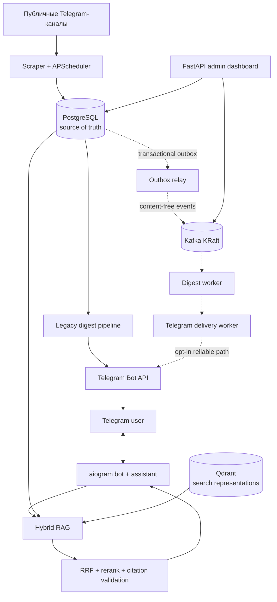

# Channel Scanner

[](https://github.com/bzzbbzbz/Channel-Scanner/actions/workflows/ci.yml)

Channel Scanner - pet-проект для портфолио: Telegram-бот, который собирает посты из публичных Telegram-каналов, хранит их в PostgreSQL и присылает пользователю персональные дайджесты по расписанию.

Бот: [@ChanScanbot](https://t.me/ChanScanbot)

Проект сделан как полноценный backend-сервис, а не как набор скриптов: есть миграции, асинхронная работа с БД, планировщик задач, Telegram Bot API polling, гибридный RAG, событийный контур доставки через Kafka, fallback-сценарии, эксплуатационная панель, E2E-проверки и документация архитектурных инвариантов.

## Масштаб проекта

- **Два режима выполнения:** компактное однопроцессное приложение для обычной эксплуатации и отдельный event-driven контур из четырех ролей для надежной доставки.
- **Разделение хранения и транспорта:** PostgreSQL как источник истины, Qdrant для поисковых представлений RAG и Kafka как транспорт событий без пользовательского содержимого.
- **Полный жизненный цикл RAG:** модерация и импорт корпуса, обогащение и индексирование, гибридный поиск, reranking, grounded-ответ с проверенными inline-цитатами, честный отказ и измеримый rollout.
- **Production-oriented reliability:** transactional outbox, inbox deduplication, leases, retries с backoff, DLQ, идемпотентный replay, process heartbeats и операционная Kafka-вкладка.
- **Проверка отказов, а не только happy path:** отдельные PostgreSQL/Kafka process E2E, fake Telegram для неоднозначных сетевых исходов и принятый real Telegram E2E с проверкой подавления дубля.

## Что умеет

- Управляет пользователями и именованными подписками прямо в Telegram.
- Позволяет добавлять публичные каналы в конкретную подписку, а не глобально на пользователя.
- Периодически парсит публичные страницы `https://t.me/s/<channel>` без Telegram Client API.
- Хранит посты, каналы, подписки и историю доставок в PostgreSQL.
- Отправляет дайджесты по расписанию с учетом часового пояса пользователя.
- Не присылает исторические посты, опубликованные до добавления канала в подписку.
- Дедуплицирует доставку на уровне пары `подписка + пост`.
- Поддерживает два режима дайджеста: короткий формат `200 символов` и LLM-пересказ.
- Использует OpenRouter-compatible Chat Completions API для суммаризации.
- Не блокирует доставку, если LLM недоступна: бот автоматически откатывается к короткому формату.
- Рендерит сообщения в Telegram-safe HTML.
- Поддерживает natural-language управление подписками через LLM-инструменты и локальную mem0-память.
- Отвечает на вопросы по утвержденным публичным каналам через гибридный RAG с прямыми ссылками на оригинальные Telegram-посты.
- Имеет аутентифицированную административную панель с продуктовыми, RAG- и Kafka-метриками без вывода пользовательского содержимого.

## Инструменты ассистента

Ассистент понимает обычные сообщения и использует только инструменты с областью доступа текущего пользователя:

- `getSubscriptions`, `getSubscription` - показать подписки, их каналы и настройки.
- `createSubscription` - создать именованную подписку после явного подтверждения.
- `addChannels`, `removeChannels` - добавить или удалить публичные каналы в конкретной подписке.
- `setNotification` - установить расписание уведомлений в формате cron.
- `setDigestFormat`, `setSubscriptionEnabled` - включить AI-пересказ и активировать либо отключить подписку.
- `setFilterPrompt`, `setSummaryPrompt`, `resetPrompts` - настроить или вернуть стандартные AI-инструкции.
- `getRecentDigests` - показать недавние дайджесты пользователя.
- `getDigestProcessingLogs` - вывести количества найденных, отфильтрованных и включенных постов за выбранный период.
- `generateOnDemandDigest` - собрать и прислать дайджест по явно названной подписке за указанный период; повторный запрос переиспользует сохраненный результат.
- `debugDigestPrompts` - безопасно проверить кандидатные filter/summary prompts на уже сохраненных постах без доставки и изменения настроек.

Ограничения по умолчанию: до 5 подписок на пользователя, до 10 каналов в подписке и до 10 вызовов инструментов за один запрос ассистенту.

## RAG по публичным каналам

RAG здесь является отдельной подсистемой, а не одним вызовом vector search:

1. Администратор утверждает публичный канал и импортирует официальный Telegram JSON export; канонические посты идемпотентно сохраняются в PostgreSQL.
2. DeepSeek строит fixed-schema метаданные, а `summary`, `full` и `chunk` представления индексируются в локальном Qdrant. Сбой обогащения не удаляет источник: пост остается доступен для лексического поиска и попадает в ограниченный retry-процесс.
3. Запрос проходит параллельный лексический и векторный поиск. Результаты схлопываются по родительскому посту через RRF, поэтому разные чанки одного поста не занимают весь top-k.
4. Cohere Rerank-4-Pro переупорядочивает до 20 уже авторизованных канонических постов. При ошибке, невалидном ответе или превышении cost cap система возвращается к базовому ranking.
5. DeepSeek формирует структурированные утверждения со ссылками на post ID. Каждый ID проверяется против разрешенного набора, после чего ответ рендерится в Telegram-safe HTML с inline-ссылками на оригиналы.

Scope применяется **до внешних LLM/rerank-вызовов**: учитываются владелец подписки, членство канала и `subscribed_at`. Каталог, mem0 и история чата помогают выбрать область поиска, но не считаются доказательствами ответа. Если подтвержденных источников недостаточно, ассистент возвращает честный отказ вместо похожих, но не отвечающих на вопрос публикаций.

Для RAG есть отдельный evaluation pipeline: 126 размеченных позитивных и негативных вопросов, dev/eval split, retrieval/citation/claim/latency/cost-метрики, параллельный resumable runner и семантический judge, откалиброванный против ручной разметки. Подробности и результаты: [`docs/rag-architecture.md`](docs/rag-architecture.md).

## Надежная доставка через Kafka

Опциональный BL-22 контур разбивает плановую доставку на четыре процесса из одного Docker-образа:

- `scheduler` атомарно создает `DigestRun` и корневой `OutboxEvent` в транзакции PostgreSQL;
- `outbox-relay` публикует версионированный event envelope в Kafka и восстанавливается через lease/backoff после неоднозначного результата;
- `digest-worker` дедуплицирует вход через inbox, рендерит и сохраняет все части дайджеста до публикации delivery event;
- `telegram-delivery-worker` является единственной ролью с `BOT_TOKEN`, отправляет сохраненные части и фиксирует попытки, retry timing и итог доставки.

Kafka переносит только идентификаторы и routing metadata: тексты постов, дайджестов, prompts, chat ID и токены в события не попадают. Контур поддерживает четыре фиксированные v1-темы, transactional outbox, inbox deduplication, recoverable leases, bounded retries, DLQ и единичный идемпотентный replay из admin dashboard. Единая ownership policy не позволяет одной подписке одновременно попасть в legacy и reliable delivery.

Reliable path прошел изолированный process/browser E2E и отдельный real Telegram E2E, но общий rollout намеренно выключен. В production Kafka сейчас работает в **shadow mode**: четыре роли и их heartbeats наблюдаются непрерывно, а пользовательские дайджесты по-прежнему отправляет проверенный legacy path. Это демонстрирует инфраструктуру и наблюдаемость без рискованного переключения трафика.

## Архитектура

По умолчанию приложение запускается одним Python-процессом:

1. Загружает настройки из `config.toml` и переменных окружения.
2. Создает async SQLAlchemy engine и фабрику сессий.
3. Создает HTTP-клиент для чтения публичных Telegram-страниц.
4. Запускает `APScheduler` для парсинга, обновления LLM-моделей и доставки дайджестов.
5. При наличии `BOT_TOKEN` запускает Telegram bot polling через `aiogram`.
6. При `ADMIN_ENABLED=1` запускает изолированную read-only admin dashboard на внутреннем порту `8080`.

Если `BOT_TOKEN` не задан, scraper и scheduler могут работать без Telegram polling.

При включении Compose-профиля `bl22` рядом запускаются Kafka и четыре изолированные роли reliable-контура. PostgreSQL остается источником истины, поэтому Kafka-сообщение является ссылкой на durable work, а не местом хранения бизнес-данных.

Общая схема:



Сплошные линии показывают активный основной путь, пунктирные - опциональный reliable-контур. Дополнительные решения описаны в [`docs/architecture.md`](docs/architecture.md) и [`docs/rag-architecture.md`](docs/rag-architecture.md). Внутренняя инструкция наблюдения за Kafka вынесена из публичной документации в `.planning/`.

## Стек

| Зона | Технологии |
| --- | --- |
| Язык | Python 3.11+ |
| Telegram bot | aiogram 3.x, Telegram Bot API polling |
| Планировщик | APScheduler |
| База данных | PostgreSQL, SQLAlchemy asyncio, asyncpg |
| Миграции | Alembic |
| HTTP и парсинг | httpx, BeautifulSoup4, markdownify |
| LLM | OpenRouter-compatible API, динамический pool бесплатных моделей |
| RAG | PostgreSQL lexical search, Qdrant, parent-level RRF, Cohere Rerank, DeepSeek grounded answers |
| Память ассистента | mem0, локальное хранилище в `.data/` |
| Событийная доставка | Apache Kafka 3.9 KRaft, aiokafka, transactional outbox/inbox, DLQ |
| Тесты | pytest, pytest-asyncio, Playwright, JSON Schema, SQLite/PostgreSQL/Kafka E2E |
| Деплой | Docker, Docker Compose |
| Наблюдаемость | FastAPI dashboard, Kafka metadata/lag probe, role heartbeats, queue/lease/DLQ gauges |

## GitHub

- CI настроен через GitHub Actions: [`ci.yml`](.github/workflows/ci.yml) запускает `pytest` на push и pull request.
- Workflow-проверки выполняются для веток `main` и `master`, а также для pull request.
- CI поднимает `ubuntu-latest`, устанавливает Python `3.12`, ставит зависимости через `python -m pip install -e ".[dev]"` и запускает полный тестовый набор командой `pytest`.
- Лицензия проекта: [`MIT`](LICENSE).
- `AGENTS.md` оставлен в репозитории как часть engineering-процесса: он фиксирует правила работы AI-агентов, инварианты и команды проверки.

## Доменная модель

- `users` - Telegram-пользователи, язык и часовой пояс.
- `subscriptions` - именованные подписки пользователя: формат дайджеста, cron/frequency, enabled-state, режим пересказа и custom prompt.
- `subscription_channels` - связь подписки с каналами и timestamp начала подписки.
- `channels` - общий реестр отслеживаемых публичных каналов.
- `posts` - сохраненные посты каналов.
- `digest_deliveries` - состояние доставленных или пропущенных постов для дедупликации.
- `chat_messages` - история диалога для natural-language assistant.
- `knowledge_channels`, `knowledge_documents`, `knowledge_representations` - утвержденный RAG-каталог, семантические записи и поисковые представления; канонический текст остается в `posts`.
- `knowledge_queries`, `knowledge_evaluation_runs` - content-free телеметрия поиска, качества и задержек.
- `outbox_events`, `inbox_events`, `digest_runs`, `digest_outbox_messages` - durable state надежного Kafka-контура.
- `dead_letter_records`, `dead_letter_replays` - терминальные ошибки и append-only аудит повторного запуска.
- `reliability_role_heartbeats` - последнее поколение и lifecycle-state каждой Kafka-роли.

## Надежность

В проекте явно закреплены инварианты, которые важны для production-поведения:

- один и тот же пост не доставляется повторно в одну подписку;
- разные подписки одного пользователя могут получать один и тот же пост независимо;
- новые подписки не получают старые посты канала;
- сбой LLM не ломает доставку дайджеста;
- Telegram-сообщения проходят через safe HTML rendering;
- Kafka-события не содержат пользовательские тексты, prompts или токены;
- outbox создается в одной транзакции с бизнес-состоянием, а inbox подавляет повторную обработку одного event ID;
- lease и retry deadlines ограничены, терминальные ошибки переходят в DLQ;
- только delivery worker получает Telegram credential;
- RAG цитирует только scope-authorized канонические посты, а не summary/chunk или память;
- локальные данные, `.env`, ключи и backlog-файлы не попадают в git.

Для AI-assisted разработки в репозитории оставлен `ai/knowledge-graph/`: он описывает ключевые сущности, сценарии, инварианты и проверочные тесты. Это не секреты и не backlog, а архитектурная документация проекта.

## Быстрый старт

### 1. Подготовить окружение

```bash
cp .env.example .env
```

Заполните в `.env` реальные значения:

```env
BOT_TOKEN=<telegram-bot-token>
OPENROUTER_API_KEY=<openrouter-api-key>
DB_PASSWORD=<local-db-password>
PGADMIN_DEFAULT_PASSWORD=<local-pgadmin-password>
ADMIN_USERNAME=<admin-login>
ADMIN_PASSWORD_HASH=<output-of-password-helper>
ADMIN_SESSION_SECRET=<long-random-secret>
```

`OPENROUTER_API_KEY` опционален: без него бот продолжит работать в коротком режиме дайджестов.

### Админ-панель

Панель доступна только после явного включения и не позволяет менять данные. Создайте PBKDF2-хэш пароля, задайте credentials в `.env`, включите `ADMIN_ENABLED=1` и запустите TLS-proxy:

```bash
python -m src.admin.passwords 'replace-with-a-strong-password'
docker compose up --build -d app
```

После DNS-записи `csd.ai-research.arha.digital` на сервер добавьте в host-managed Caddy маршрут на `channel-scanner:8080` в общей Docker-сети; Caddy получает и обновляет TLS-сертификат. Панель показывает 24 часа, 7 дней, всё время и произвольный UTC-период; LLM token/cost telemetry начинает собираться с включения этого релиза и не реконструирует прошлые расходы.

### 2. Запустить через Docker Compose

```bash
docker compose up --build
```

Контейнер приложения применит миграции и запустит:

```bash
python -m src.main
```

### 3. Локальный запуск без Docker

```bash
pip install -e ".[dev]"
alembic upgrade head
python -m src.main
```

### Kafka shadow mode

Безопасный наблюдаемый запуск Kafka-контура без переключения пользовательской доставки:

```env
KAFKA_ENABLED=1
RELIABLE_DIGEST_ENABLED=0
RELIABLE_DIGEST_SUBSCRIPTION_IDS=[]
MEMORY_ENABLED=1
```

```bash
docker compose --profile bl22 up --build -d
```

Состояние брокера, topics, consumer groups, четырех role heartbeats, queues, leases и DLQ отображается во вкладке `Kafka` административной панели. `RELIABLE_DIGEST_ENABLED=1` не следует включать без отдельного rollout-решения.

## Команды разработки

```bash
pytest
pytest tests/integration/test_digest_delivery.py
pytest tests/integration/test_bot_service.py
pytest tests/integration/test_scheduler.py
npm run test:browser
alembic revision --autogenerate -m "message"
alembic upgrade head
```

## Тестирование

Основные проверки покрывают:

- управление пользователями, настройками и подписками;
- добавление и удаление каналов внутри конкретной подписки;
- scraping job и idempotent-сохранение постов;
- выборку постов для дайджеста;
- дедупликацию доставок;
- fallback при ошибках LLM;
- Telegram-safe formatting;
- assistant tools и cron-уведомления;
- RAG scope, hybrid retrieval, parent deduplication, reranking fallback, citation validation и honest abstention;
- Kafka contracts, topic provisioning, transactional outbox/inbox, leases, retry, DLQ и idempotent replay;
- process-level PostgreSQL/Kafka E2E с контролируемыми сбоями между broker ACK, DB commit и offset commit;
- opt-in real Telegram E2E сценарии для отдельного тестового чата.

Обычные unit/integration тесты не требуют PostgreSQL или Docker: они используют in-memory SQLite через `tests/conftest.py`.

## Безопасность перед публикацией

В публичный репозиторий не должны попадать:

- `.env` и любые `.env.*`, кроме `.env.example`;
- `.data/` с локальной mem0/Qdrant/SQLite state;
- `.planning/` с backlog, черновиками и внутренними планами;
- кеши Python, pytest, build-артефакты и IDE-файлы;
- реальные Telegram/OpenRouter токены.

Если реальные токены уже были случайно опубликованы, их нужно перевыпустить у провайдера, даже если потом удалить файл из git.

## Что можно улучшить дальше

- Добавить lint и проверку миграций в GitHub Actions.
- Подключить secret scanning до публикации: например `gitleaks` и GitHub Secret Scanning.
- Добавить демо-скриншоты Telegram UI в `docs/`.
- Разделить production и demo-конфиги, если проект будет деплоиться публично.
- Перевести mem0 на безопасное общее хранилище перед общим rollout отдельного reliable digest worker.
