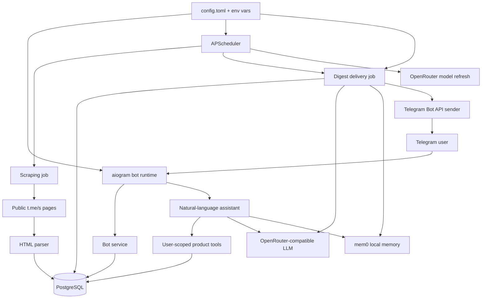

# Архитектура Channel Scanner

Channel Scanner запускается как один Python-процесс: Telegram bot polling, APScheduler jobs, scraper, LLM-суммаризация и доставка дайджестов работают в одном runtime.

## Ключевые решения

- Один процесс упрощает локальный запуск и portfolio deployment: не нужен отдельный worker для планировщика.
- PostgreSQL остается production-хранилищем, а тесты используют in-memory SQLite для быстрой интеграционной проверки.
- Scraper читает публичные страницы `t.me/s/*`, поэтому для чтения каналов не нужен Telegram Client API.
- Доставка дайджестов дедуплицируется по паре `subscription + post`, а не только по пользователю.
- LLM-суммаризация опциональна: при ошибках модели доставка откатывается к короткому режиму.
- `.data/` используется только для локального runtime-state и исключена из git и Docker build context.
