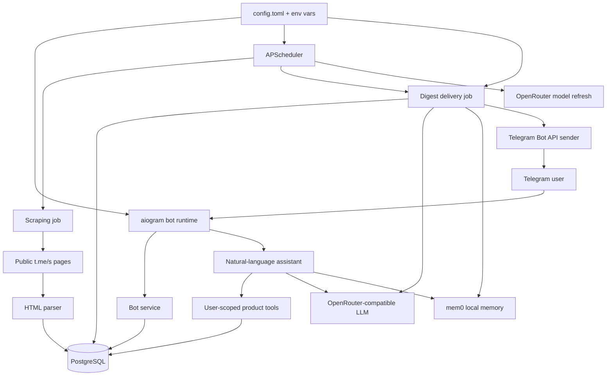

# Архитектура Channel Scanner

По умолчанию Channel Scanner запускается как один Python-процесс: Telegram bot polling, APScheduler jobs, scraper, LLM-суммаризация и доставка дайджестов работают в одном runtime. Опциональный BL-22 reliable path запускает scheduler, outbox relay, digest renderer и Telegram delivery как отдельные роли из того же образа; PostgreSQL остаётся источником истины, Kafka передаёт только content-free ссылки на работу. BL-29 позволяет держать те же роли в наблюдаемом shadow mode без передачи им production delivery ownership.

## Ключевые решения

- Один процесс упрощает локальный запуск и portfolio deployment: не нужен отдельный worker для планировщика.
- PostgreSQL остается production-хранилищем, а тесты используют in-memory SQLite для быстрой интеграционной проверки.
- Scraper читает публичные страницы `t.me/s/*`, поэтому для чтения каналов не нужен Telegram Client API.
- Доставка дайджестов дедуплицируется по паре `subscription + post`, а не только по пользователю.
- LLM-суммаризация опциональна: при ошибках модели доставка откатывается к короткому режиму.
- `.data/` используется только для локального runtime-state и исключена из git и Docker build context.

## BL-29 Kafka Shadow Operations (Accepted 2026-08-24)

- Shadow mode включается только явной комбинацией `KAFKA_ENABLED=1`, `RELIABLE_DIGEST_ENABLED=0`, `MEMORY_ENABLED=1` и запуском `docker compose --profile bl22 up -d`. Без профиля значение приложения остаётся `KAFKA_ENABLED=0`.
- В этом режиме mem0 продолжает работать в основном приложении, ни одна production-подписка не принадлежит reliable policy, scheduler/digest/delivery роли остаются readiness-only, а legacy scheduler и sender являются единственным пользовательским путём доставки. Outbox relay запущен, но при выключенном reliable master доменные producer-ы не создают новую reliable-работу.
- `ReliabilityRoleHeartbeat` хранит в PostgreSQL одну последнюю generation для каждой из четырёх ролей: `scheduler`, `outbox-relay`, `digest-worker`, `telegram-delivery-worker`. Состояния ограничены `starting`, `ready`, `stopped`, `failed`; сохраняются timestamps и только bounded exception-class code. Heartbeat обновляется best-effort каждые 10 секунд с двухсекундным write timeout и не может остановить рабочую роль.
- Admin dashboard содержит внутренние вкладки `Обзор` и `Kafka`. Kafka-вкладка загружается только при открытии, обновляется каждые 15 секунд, пока активна, и вызывает authenticated `GET /admin/api/kafka/operations`.
- Operations snapshot объединяет PostgreSQL heartbeat/queue state с bounded Kafka metadata probe: broker latency, четыре фиксированных topic и их drift, две фиксированные consumer groups и lag, unpublished outbox, retries, expired leases, open DLQ и до 20 последних безопасных error codes. Отсутствующие группы при shadow mode показываются как ожидаемо неактивные.
- Живой non-terminal heartbeat старше 30 секунд классифицируется как `stale`. Явные `stopped` и `failed` имеют приоритет над возрастом, поэтому clean stop отличается от crash/failure и никогда не отображается healthy.
- Probe ограничен общим deadline в 5 секунд и работает single-flight. После `ProbeTimeout` cancellation-resistant probe/cleanup не позволяет создать следующий Kafka client; параллельный auto/manual refresh получает content-free `ProbeBusy`, пока старый ресурс не завершён.
- API и UI не показывают Kafka payload, тексты постов/дайджестов/prompts/chat, токены, allowlist подписок, exception messages или raw logs. Разрешены только mode booleans, фиксированные topic/group names, технические IDs, counts/ages, lifecycle state и bounded machine codes. Broker/probe outage возвращает unavailable snapshot и не ломает отдельно загруженный Overview.
- Production Compose smoke принят 2026-08-24. Перед миграцией сохранён backup `/tmp/opencode/telegram_bot_pre_bl29_0025.dump`, migration `0025` применена, а отдельный clean path `0001 -> 0025` прошёл. App и четыре роли использовали текущий application image; Kafka была доступна, `kafka-init` завершился с кодом `0`, четыре topic существовали без drift, четыре роли были `ready` с heartbeat age меньше 10 секунд, authenticated endpoint вернул HTTP 200.
- Live mode был `kafka=true`, `reliable=false`, `memory=true`, `delivery_path=legacy`; неактивные consumer groups были ожидаемым shadow-состоянием. Queues, recent safe errors, open DLQ и новые reliable `DigestRun` оставались нулевыми, а app scheduler, polling, mem0 и admin были healthy. Test evidence: final `365 passed, 8 skipped`; focused boundary `33 passed`; полный browser run `1 passed, 1` harness-only skipped.
- BL-29 закрыт и принят только как shadow operations. Это не разрешение на reliable rollout: `RELIABLE_DIGEST_ENABLED=0`, legacy delivery остаётся единственным production path. Ежедневные проверки и безопасный rollback описаны в `docs/kafka-shadow-operations.md`.

## BL-22 Stage 6

- Воспроизводимая команда `./scripts/run-bl22-stage6-e2e.sh` создаёт уникальные Docker Compose project, image и run ID с PostgreSQL 16, Kafka 3.9.2, fake Telegram HTTP endpoint, admin runtime и четырьмя отдельными reliable roles из рабочего образа.
- Harness не вызывает `DigestService.run_once()` как доказательство reliable path: scheduler создаёт `DigestRun + OutboxEvent`, relay публикует Kafka event, consumers фиксируют inbox/message state, а delivery вызывает fake Bot API по HTTP. Отдельный production legacy `digest_delivery_job` с fail-on-send sender подтверждает, что due-подписка уже принадлежит reliable policy и не достигает старого sender. `BOT_TOKEN` получает только delivery worker; normal app остаётся tokenless и не запускает polling или двойную доставку.
- Fail-closed faults требуют isolated UUID/endpoints и read-only sentinel. Relay завершается после broker ACK и до outbox DB update, затем lease recovery создаёт ровно одну byte-identical повторную публикацию. Digest worker завершается после handler DB commit и до offset commit; restart подтверждает реальные Kafka records/group offset без ручного rewind и повторного render/outcome.
- Publish deadline relay остаётся жёстким даже если idempotent Kafka client не завершает cancellation: внешняя send task отменяется без блокирующего join, а PostgreSQL row возвращается в content-free retry state. В isolated E2E backoff deterministic, failed snapshot фиксируется остановкой outage-era producer, а recovery ускоряет только существующий `next_attempt_at`.
- Fake Telegram отдельно доказывает accepted-withheld ambiguous send: второй accepted message ID имеет тот же SHA-256. Остальные окна включают expired leases, restart частичной отправки, terminal retry exhaustion, DB+Kafka DLQ и browser-driven list/detail/idempotent replay controls.
- Readiness каждой critical role создаётся только после её dependency/producer/consumer startup и привязана к role, PID и `/proc` process-start ticks. Stop каждой роли делает её неготовой, restart создаёт новую process generation и возвращает semantic readiness.
- Authenticated `/admin/api/reliability/metrics` возвращает только counts/ages для unpublished outbox, pending retries, expired leases и open DLQ. Structured transition logs содержат только `event_id`, `correlation_id`, `run_id`, `message_id`, attempt и state; fake Telegram evidence, Kafka/DLQ audit, metrics и logs не содержат текст публикаций, частей дайджеста или bot token.
- Cleanup выполняется в `finally` через `docker compose down --volumes --remove-orphans`, удаляет только уникальный test image и затем проверяет отсутствие UUID-labeled containers/network/volumes и exact image. Ошибка cleanup падает сама или добавляется к исходной ошибке; production Compose project, services и database не затрагиваются.

## BL-22 Stage 7 (Accepted 2026-08-24)

- `./scripts/run-bl22-stage7-e2e.sh` является отдельным opt-in real-Telegram runner. Он fail-hard проверяет `.env`, строит уникальный image/project, мигрирует чистую PostgreSQL 16 до `0024`, поднимает Kafka 3.9.2 и не использует production DB/Kafka или существующие shadow roles.
- Текущий production `app` остаётся непрерывно работающим poller и не управляется runner-ом; isolated poller отсутствует. Harness проверяет effective credential, ID/StartedAt и startup polling markers, а после уникального `/start BL22S7_<runid>` требует strict tester-row transition относительно baseline и новую handled-update line. Это deployment-specific empirical acceptance, не универсальная гарантия Telegram и не доказательство отсутствия неизвестного внешнего poller сверх no-conflict logs.
- Isolated Compose зеркалирует только фактические tester_id/chat_id/chat_type, после чего запускает четыре allowlisted reliable roles. Product token передаётся только delivery worker через удаляемый 0600 Compose secret и fail-closed `BOT_TOKEN_FILE`; tester token не покидает host Bot objects.
- Tester bot не может читать сообщения product bot. Поэтому real-send evidence состоит из успешного `sendMessage` response, сохранённого Telegram message ID, marker внутри persisted part и единственного content-free sent transition.
- Exact persisted root envelope повторно публикуется без изменения DB; audit consumer сравнивает ровно две Kafka records по key, partition и SHA-256 bytes, основной consumer offset продвигается, а run/part/attempt/delivery/log/send остаются единичными.
- Fail-hard cleanup сначала использует Compose с полным non-secret env, затем fallback force-removes exact project-label containers и лишь после них volumes/networks/image; token file удаляется только когда containers точно отсутствуют, а image absence требует explicit `No such image` inspect.
- Real Telegram acceptance успешно завершён за `450.883s` с одной принятой digest send, completed run/inboxes, подавленным exact duplicate, непрерывным production app и успешным cleanup. Evidence: `.planning/evaluations/bl22-stage7/bl22-stage7-20260824T045339.868888Z.json`.
- BL-22 закрыт этим acceptance, но общий reliable rollout не включён: default switch остаётся off и legacy scheduled path продолжает обслуживать подписки без явного reliable ownership.

## Alembic Clean Boot

- Чистая PostgreSQL должна проходить `alembic upgrade head` от отсутствующей `alembic_version` до текущего head за один запуск.
- `alembic/env.py::ensure_version_table_capacity` до `context.run_migrations()` создаёт version table с `VARCHAR(64)` и расширяет существующую PostgreSQL-колонку. Это обязательно, потому что descriptive revision IDs длиннее стандартных 32 символов.
- Stage-6 E2E делает миграцию первой database operation на новом volume; ошибка создания/расширения version table или любой ревизии останавливает весь acceptance run.
