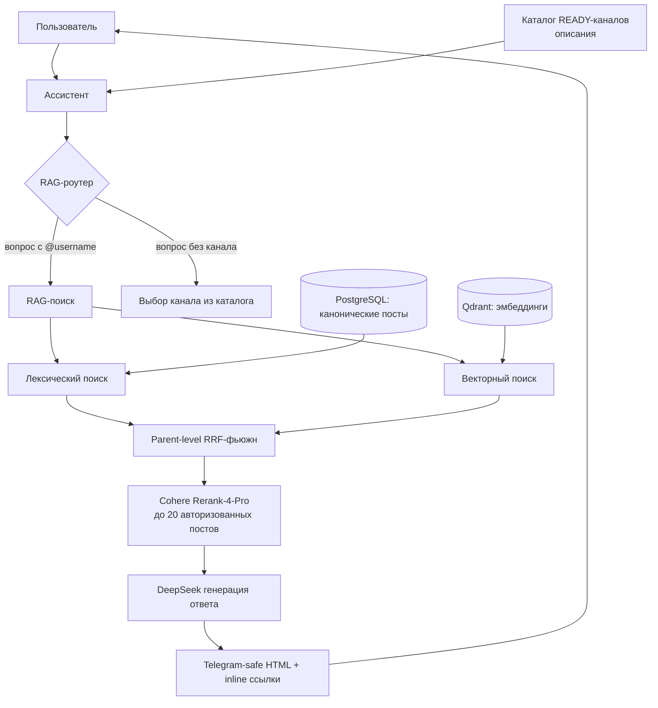

# RAG: архитектура, измерения и результаты

Этот документ описывает систему RAG в Channel Scanner: как устроен публичный
поиск по каналу, как он измеряется, какие решения приняты и на каких метриках
основаны выводы. Он предназначен для пользователей и инженеров, оценивающих
экспертизу в построении RAG.

---

## 1. Что такое этот RAG

Бот собирает канонические посты публичного Telegram-канала `@turboproject`
(тематика: ИИ-разработка, генерация кода агентами, методология GRACE,
внутреннее устройство LLM, провайдеры) и позволяет пользователю задавать
вопросы на естественном языке. Система:

1. находит релевантные посты (поиск),
2. читает только содержимое найденных постов,
3. строит ответ с inline-ссылками на конкретные оригинальные посты.

Ключевой принцип: **первоисточник — это пост канала**. Ответ всегда цитирует
конкретные посты, а не выдаёт общий текст.

---

## 2. Архитектура

### 2.1 Ингрессия и индекс

- **Каталог**: администратор утверждает публичный канал; официальный Telegram
  export импортируется идемпотентно (`channel_id + post_id` уникальны).
- **Представления**: каждый пост получает fixed-schema представления —
  summary (семантическая карточка), full (весь текст для коротких постов),
  chunk (параграф-чанки для длинных).
- **Обогащение**: DeepSeek извлекает entities/topics/questions/claims для
  summary-карточки; эмбеддинги — `qwen/qwen3-embedding-8b` (4096 измерений),
  локальный Qdrant в `.data/knowledge`.
- **Ретраи**: сбой обогащения/векторизации записывается с ограниченным числом
  попыток и догоняется 4-часовой knowledge-джобой; посты остаются доступными
  для лексического поиска.

### 2.2 Поиск (retrieval)

- **Лексический поиск** по каноническому тексту поста.
- **Векторный поиск** с фиксированной инструкцией к запросу
  («Represent this question for retrieving relevant public Telegram posts»).
- **Parent-level fusion (RRF)**: разные представления одного поста схлопываются
  в один родительский ранг, чтобы один пост занимал один слот.
- **Фасеты**: для вопросов «граф/вектор», «навигация по коду»,
  «документация» добавляются небольшие фиксированные retrieval-фасеты;
  их первый источник обязан быть процитирован в ответе.
- **Реранкер**: `cohere/rerank-4-pro` ранжирует до 20 уже авторизованных
  канонических постов. Ошибки провайдера, невалидный ответ, недоступная цена
  или превышение лимита → безопасный возврат к базовому ранжированию.

### 2.3 Область доступа (scope)

- Публичный каталог: поиск только по утверждённым READY-каналам.
- Подписки: применяются владение пользователем, членство в канале и граница
  `subscribed_at` до любого внешнего вызова.
- Реранкер получает только вопрос и до 20 уже разрешённых постов — никакой
  памяти, истории, токенов или настроек.

### 2.4 Ответ (grounded answer)

- Модель возвращает структурированный JSON: `claims[]` с текстом и
  `cited_post_ids` (1–3 поста на утверждение), `evidence_sufficient`,
  `conflict_detected`.
- Каждый процитированный id валидируется против переданного набора;
  утверждение без валидной ссылки отбрасывается.
- Рендеринг — Telegram-safe HTML; ссылки вида
  `https://t.me/<channel>/<post_id>` сразу после утверждения; максимум пять
  уникальных ссылок.
- Модель генерации — DeepSeek через OpenRouter (по умолчанию) или прямой
  DeepSeek API (флаг `answer_direct_enabled`); OpenRouter остаётся fallback.

### 2.5 Ассистент и выбор канала

- Снимок READY-каналов с нейтральными описаниями грузится как доверенный
  контекст в начале хода — «какие каналы есть» отвечается без вызова
  инструмента.
- Явный `@username` → поиск сразу в одном канале; вопрос без канала →
  предложение одного уверенного или до трёх вариантов; поиск не расширяется
  молча на весь каталог.

---

## 3. Как система измеряется (бенчмарк)

### 3.1 Набор данных

`.planning/evaluations/turboproject-ai-2025-2026-v2.jsonl` — 126 кейсов:

- **106 позитивных** (ответ есть в корпусе) + **20 негативных** (ответа нет);
- **dev 99 / eval 27** — eval зарезервирован для финальной оценки и не участвует
  в подборе конфигураций;
- 30 вопросов взяты из реальных сообщений чата канала и переформулированы
  «с чистого листа» (без подсказок-терминов из ответа): GRACE, семантическая
  разметка, вэньянь-промптинг, модели/провайдеры, практика;
- эталонный ответ для каждого позитивного кейса: профессиональный русский
  ответ с inline-ссылками + атомарные утверждения (claims) с их постами;
- каждое утверждение привязано к конкретному каноническому посту, а схема
  загрузчика валидирует покрытие ссылок и постов.

Отдельный файл с полным списком вопросов/ответов:
`docs/rag-benchmark-questions.md`.

### 3.2 Метрики поиска (retrieval)

| Метрика | Значение | Смысл |
|---|---|---|
| Recall@5 | 0.833 | доля нужных постов, попавших в топ-5 |
| MRR | 0.804 | насколько высоко первый правильный пост |
| nDCG@5 | 0.794 | качество порядка всех пяти результатов |
| Precision@5 | 0.191 | доля релевантных в топ-5 (полная разметка) |
| Достаточность источника | 0.887 | вопрос с ≥1 ожидаемым постом в топ-5 |
| Достаточность по claims | 0.839 | доля покрытых эталонных утверждений |

### 3.3 Метрики ответа (answer)

| Метрика | Значение | Смысл |
|---|---|---|
| Citation precision | 0.458 | доля процитированных постов, ожидаемых эталоном |
| Citation recall | 0.803 | доля ожидаемых постов, процитированных системой |
| Citation F1 | 0.544 | гармоническое среднее |
| Точность привязки «тезис → ссылка» | 0.297 | стоит ли ссылка после своего утверждения |
| Claim F1 (детерм.) | 0.214 | токеновая эвристика совпадения утверждений |
| Claim F1 (семантический судья) | 0.258 | LLM-судья по покрытию существенных аспектов |

Семантический судья откалиброван против ручной разметки оператора
(20 пар, согласие **17/19 = 0.895**, порог 0.8). Судья сравнивает утверждение
модели с эталоном по «покрытию существенных аспектов» (центральный тезис +
отрицания/ограничения/сопоставления), а не по совпадению слов.

### 3.4 Негативные кейсы (честный отказ)

| Метрика | Значение | Смысл |
|---|---|---|
| Корректный отказ | 0.0 | система НЕ отказывается на вопросах без ответа |
| Ложная выдача источников | 1.0 | на всех 20 негативах показаны источники |

**Это главный открытый риск**: на вопросах, ответа на которые в корпусе нет,
система подбирает похожие посты вместо честного отказа. Зафиксировано как
TD-023; требуется политика абстенции перед расширением доступа.

### 3.5 Задержки и стоимость

| Метрика | Значение |
|---|---|
| Поиск (retrieval), средняя | 15.8 с |
| Генерация ответа, средняя | 17.6 с |
| Генерация ответа, p95 | 40.4 с |
| Контекст источников | ~1084 токена |

Доминирующая стадия — генерация ответа. Интерактивные тайм-ауты RAG
намеренно отключены (режим измерения); эксплуатационные значения выберут
по этим данным в BL-25.

---

## 4. Проделанные действия (краткая история)

1. **BL-21** (закрыт): изолированные эксперименты; рекомендация instructed
   vector search + Cohere Rerank-4-Pro по 20 постам.
2. **BL-23** (закрыт): безопасный контур выпуска — версионированная
   конфигурация, канареечный allowlist (только тестовый бот), content-free
   телеметрия, read-only дашборд качества, запасной путь и лимиты.
3. **BL-24** (закрыт): разговорный RAG — каталог с описаниями, выбор одного
   канала без технических id, структурированные claims с inline-ссылками,
   измерение задержек по стадиям; выбран `bl24-rerank20-v2` (recall 0.895 на
   старом наборе).
4. **BL-26** (в работе): бенчмарк v2 — реальные вопросы пользователей,
   негативные кейсы, dev/eval разделение, семантический судья (калибровка
   0.895), прямой DeepSeek-клиент, параллельный оценщик; полный прогон на
   OpenRouter завершён (раздел 3).

---

## 5. Конфигурация

`config.toml` / env:

- `KNOWLEDGE_RAG_ROLLOUT_ENABLED`, `KNOWLEDGE_RAG_CANARY_TELEGRAM_IDS` —
  канареечный allowlist (только тестовый бот);
- `KNOWLEDGE_RAG_RERANKER_MODEL=cohere/rerank-4-pro`,
  `KNOWLEDGE_RAG_RERANK_CANDIDATE_LIMIT=20`;
- `KNOWLEDGE_ANSWER_MODEL=deepseek/deepseek-v4-flash`;
- `KNOWLEDGE_DEEPSEEK_API_KEY` / `KNOWLEDGE_ANSWER_DIRECT_ENABLED` — прямой
  DeepSeek для ответов (по умолчанию выключен);
- `KNOWLEDGE_JUDGE_MODEL=deepseek-v4-flash`,
  `KNOWLEDGE_JUDGE_VERSION=v6-2026-08-14`;
- тайм-ауты стадий RAG = 0 (режим измерения).

---

## 6. Честные ограничения

- Один канал (`@turboproject`) — результат не доказывает качество на других
  темах/языках.
- Claim-метрики (детерминированная и судья) — прокси качества текста; судья
  откалиброван на одной выборке и требует периодического ручного аудита.
- Precision@5 честен только при полной разметке (в наборе она есть).
- Задержки измерены на одном полном прогоне; распределение провайдера требует
  повторов.
- Негативные кейсы показывают отсутствие честного отказа (раздел 3.4).

---

## 7. Код и тесты

- `src/knowledge/`: `service.py` (поиск/ответ), `search.py`, `indexer.py`,
  `evaluation.py`, `evaluate_runner.py`, `judge.py`, `importer.py`,
  `enrichment.py`, `repository.py`.
- `src/llm/`: `openrouter.py`, `deepseek.py`.
- Тесты: `tests/unit/test_knowledge_evaluation.py`,
  `test_knowledge_judge.py`, `test_deepseek_client.py`,
  `test_knowledge_rollout.py`, `test_conversational_rag.py`,
  `tests/integration/test_knowledge_search.py`,
  `test_knowledge_assistant_tools.py` (58 зелёных).
- Запуск оценки:
  `python -m src.knowledge.evaluate_runner <dataset> --username <channel> --candidate --judge --concurrency 10 --checkpoint <path>`
